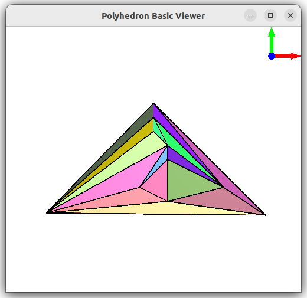

# random_maximal_planar_embedding
Create a ranodm maximal planar (combinatorial) embedding, based on [chapter 8 algorithm](https://raw.githubusercontent.com/Hermann-SW/randomgraph/4bb2caf643b0016c32820349eb3ea772c53fb529/IAI-TR-93-10.ps.pdf#page=13) of 1993 technical report, and on code from that time in this repo:  
https://github.com/Hermann-SW/randomgraph

This will host pure Boost graph implementation, which allows to directly continue with call to ```chrobak_payne_straight_line_drawing()``` to get the straight line drawing, without the other calls to BGL functions before. Not even the need to call last of those functions from demo code ```planar_canonical_ordering()```, because that ordering will be already be created:  
https://gist.github.com/Hermann-SW/99d151a273d290ee0d843c79b2da26a8#file-straight_line_graphviz-cpp-L135

Using 
- discussed above ```randomgraph```to create maximal planar random graph
- CGAL lib [draw_polyhedron.cpp](https://github.com/CGAL/cgal/blob/master/Polyhedron/examples/Polyhedron/draw_polyhedron.cpp) example to display created planar straight line drawing 10.off  
(.off file has all z-coordinates 0 allowing to use ```draw_polyhedron``` as planar graph viewer)
- [straight_line_drawing.cpp](straight_line_drawing.cpp)
```
$ NOSTAT= randomgraph 10 -o 10.u
$ g++ -g -Wall -pedantic -Wextra $f.cpp -o $f
$ ./straight_line_drawing 10.u > 10.off 2>err
$ draw_polyhedron 10.off 
Using OpenGL context 4.6 GL
$ 
```



