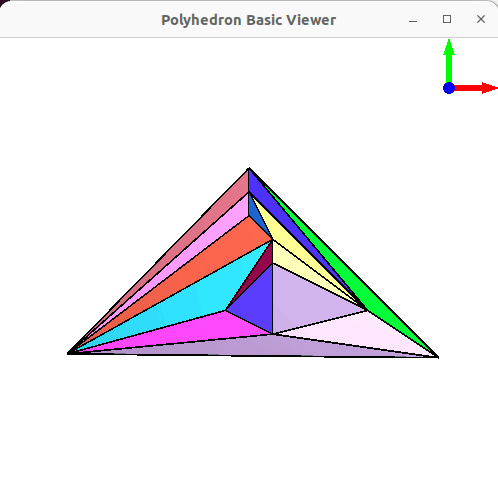

## build

<kbd>draw\_planar</kbd> gets build for Qt5 by executiong [build5](build5).

<kbd>draw\_planar</kbd> gets build for Qt6 by executiong [build6](build6).

[draw_planar.cpp](draw_planar.cpp) does assert all points z-coordinates to be 0.  
Before displaying it sets z-coordinate of first point to -1.  
Only that way the colored faces of planar embedding can be shown.  
  
build5 and build6 patch copies of CGAL files to start with colors and inverse_normal true.  

Use simply with existing [../7c.mp.off](../7c.mp.off) …
```
$ ./draw_planar ../7c.mp.off
```

… or:
```
$ NOSTAT= randomgraph 10 -o ../10.u
$ ../straight_line_drawing ../10.u > ../10.off 2>err
$ ./draw_planar ../10.off 
Using OpenGL context 4.6 GL
```


## cleanup

For Qt5 and Qt6 by executing [really_clean](really_clean).

## restriction

Currently works for maximal planar graphs only.  
So either rename to <kbd>draw_maximal_planar</kbd> or make maximal planar before drawing.  
(the 5 last edges of [../7c.mp.u](../7c.mp.u) were added to make [7c.u](https://gist.github.com/Hermann-SW/123604aaec92bb856112ef2cd2a4585a) maximal planar)
