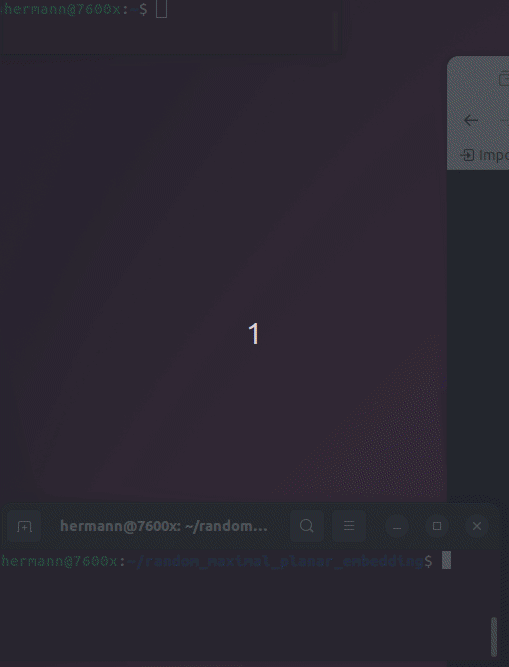

# random_maximal_planar_embedding
Create a ranodm maximal planar (combinatorial) embedding, based on [chapter 8 algorithm](https://raw.githubusercontent.com/Hermann-SW/randomgraph/4bb2caf643b0016c32820349eb3ea772c53fb529/IAI-TR-93-10.ps.pdf#page=13) of 1993 technical report, and on code from that time in this repo:  
https://github.com/Hermann-SW/randomgraph

Later here will be pure Boost graph implementation, which allows to directly continue with call to ```chrobak_payne_straight_line_drawing()``` to get the straight line drawing, without the other calls to BGL functions before. Not even the need to call last of those functions from demo code ```planar_canonical_ordering()```, because that ordering will be already created:  
https://gist.github.com/Hermann-SW/99d151a273d290ee0d843c79b2da26a8#file-straight_line_graphviz-cpp-L135

For now algorithm will be created with CGAL which includes Boost graph library, and allows to display intermediate graphs using ```CGAL::draw()``` while developing code, for visual debugging. Call to that function is blocking, but ```fork()``` with ```kill()``` of child executing ```CGAL::draw()``` even allows for automatic animation sequence. Only during CGAL code development incremental straingt line drawing coordinates will be determined per [chapter 7](https://raw.githubusercontent.com/Hermann-SW/randomgraph/4bb2caf643b0016c32820349eb3ea772c53fb529/IAI-TR-93-10.ps.pdf#page=10) of the 1993 technical report. Later better ```chrobak_payne_straight_line_drawing()``` will be used because of its much better minimal angle guarantee for generated straight line drawing.

Here is current ```CGAL::draw()``` demo sofar, with new function ```void draw_timeout(const Polyhedron& P, int ms)```, called with 400ms in [build+run](build+run). Repeated degree-3 insertions of the technical report, not random yet:  


[build+run](build+run) and [really_clean](really_clean) script do what they state.
